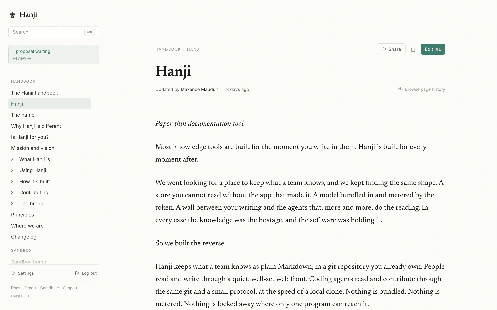

# The Hanji handbook

*Paper-thin documentation tool.*

This is Hanji's own handbook, written in Hanji, kept in Hanji's repository, and read through the product you are looking at now. 🎉

<figure><figcaption>The front: your repositories on the left, one of their pages on paper.</figcaption></figure>

## Start here

New to Hanji? Read these five, in order. Fifteen minutes, and you will know what it is, how it is different, and whether it is for you.

1. [[Hanji]], the manifesto. What it is, in one read.
2. [[What Hanji is]], how it actually works.
3. [[Why Hanji is different]], how it lands differently from other tools.
4. [[Is Hanji for you?]], an honest look at fit, with better options where they exist.
5. [[Mission and vision]], why it exists, and where it is going.

Everything below is reference. Read it when you need it.

## Using Hanji

| Page | What it is |
|---|---|
| [[Install Hanji]] | From clone to a running instance. |
| [[Mounts]] | Pointing Hanji at your repositories. |
| [[Reading and writing]] | The human front, in practice. |
| [[Agents]] | Connecting a coding agent through MCP. |
| [[Proposals]] | Reviewing and merging what agents propose. |
| [[On your tailnet]] | Sharing an instance where the network signs people in. |
| [[Command reference]] | Every CLI command, in one table. |

## The product, in depth

| Page | What it is |
|---|---|
| [[The two faces]] | The human front and the agent surface, over one git. |
| [[Permissions]] | The two-plane model, and exactly what it enforces today. |
| [[Byte-fidelity]] | Why a one-word edit is a one-line change. |
| [[Performance]] | Paper-thin: the speed and size numbers. |
| [[Features]] | The whole feature list, with honest status. |

## Go deeper

For when you want to see the machine, or build on it.

- **How it's built:** [[How it's built]] · [[The serializer]] · [[The core]] · [[The editor]] · [[The MCP server]] · [[The web front]]
- **Contributing:** [[Contributing]] · [[Developing]] · [[Conventions]] · [[Open core]]
- **Brand:** [[The brand]] · [[The visual language]] · [[Voice]]

## Project

| Page | What it is |
|---|---|
| [[Principles]] | The beliefs that break the ties. |
| [[Where we are]] | What is shipped, what is next, and what we are exploring. |
| [[Changelog]] | The road behind us, honestly logged. |
